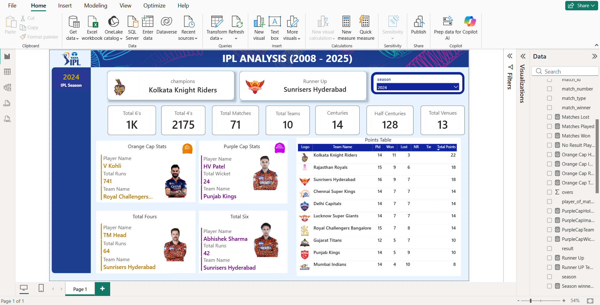
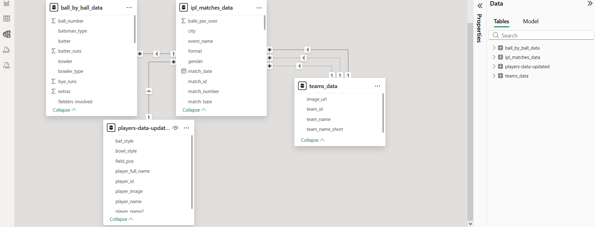

# IPL Data Analysis Dashboard (2008–2025)

## Project Overview

This project analyzes **Indian Premier League (IPL) data from 2008 to 2025** using Power BI to generate insights about team performance, player statistics, and season outcomes.

The dashboard provides an interactive way to explore IPL trends including champions, top players, match statistics, and team rankings.

---

## Tools Used

- Power BI
- Data Visualization
- Data Modeling
- DAX Measures
- Sports Data Analytics

---

## Key Dashboard Features

The dashboard provides insights into:

• IPL season champions and runners-up  
• Total matches played in the selected season  
• Total teams participating  
• Total fours and sixes hit  
• Number of centuries and half-centuries  
• Venues used in the tournament  

---

## Player Performance Insights

The dashboard highlights top player achievements:

### Orange Cap (Most Runs)
- Player: Virat Kohli
- Runs: 741
- Team: Royal Challengers Bangalore

### Purple Cap (Most Wickets)
- Player: Harshal Patel
- Wickets: 24
- Team: Punjab Kings

---

## Team Performance Analysis

The **points table** provides detailed team performance including:

- Matches Played
- Matches Won
- Matches Lost
- Net Results
- Total Points

This helps analyze **team rankings and tournament competitiveness**.

---

## Interactive Features

The dashboard includes filters such as:

- Season selector
- Dynamic statistics
- Interactive visualizations

Users can easily explore **different IPL seasons and compare team performance**.

---

## Power BI Dashboard File

Download the Power BI dashboard here:

[Download PBIX File](IPL_Analysis_2008_to_2025.pbix)

---
## Dashboard Preview

## Data Model

## Author

**Raghupathy M**  
Aspiring Data Analyst 
